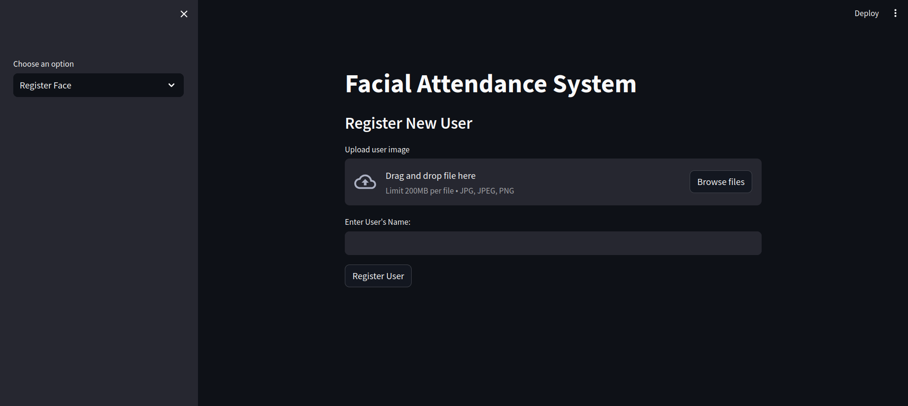
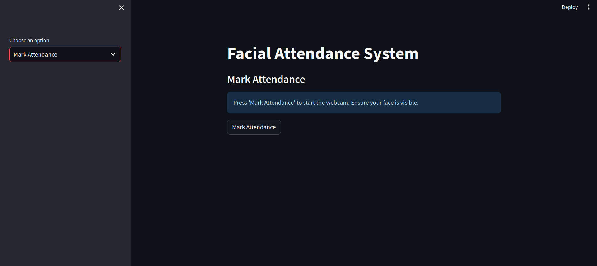
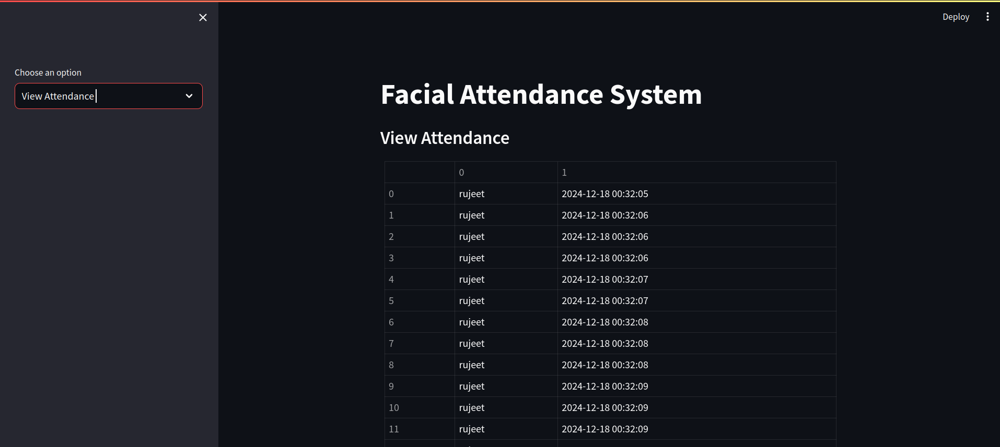

# **Facial Attendance System**

The Facial Attendance System is a web-based application built using Streamlit. It uses facial recognition to mark attendance and maintain records.

## **Features**
- **Register Faces**: Add new users to the system by uploading their face images.
- **Mark Attendance**: Use a webcam to recognize registered users and mark their attendance.
- **View Attendance Logs**: Display attendance records stored in an SQLite database.

---

## **Table of Contents**
1. [Technologies Used](#technologies-used)
2. [Getting Started](#getting-started)
3. [Usage](#usage)
4. [Screenshots](#screenshots)

---

## **Technologies Used**
1. **Python** 
   - Libraries:
     - `Streamlit`: For the web application interface.
     - `OpenCV`: For webcam handling and image processing.
     - `Face Recognition`: For facial encoding and comparison.
     - `SQLite`: Lightweight database for storing user encodings and attendance logs.

---

## **Getting Started**

### **1. Prerequisites**
- Install **Python 3** and **pip**.

### **2. Clone the Repository**
```bash
git clone https://github.com/rujeetjahagirdar/facial_attendance_system.git
cd facial_attendance_system
```

### **3. Install Dependencies**
- Use pip to install the required Python libraries:
```bash
pip install -r requirements.txt
```
### **4. Run the App**
- Launch the Streamlit app:
```bash
streamlit run main.py
```

---

## **Usage**
### **1. Register Face**
  - Navigate to the Register Face section.
  - Upload a face image and provide the user’s name.
  - Click Register User to save the face encoding to the database.

### **2. Mark Attendance**
  - Navigate to the Mark Attendance section.
  - Click Mark Attendance to start the webcam.
  - The system will detect faces and mark attendance for recognized users.

### **3. View Attendance**
  - Navigate to the View Attendance section.
  - View a table of logged attendance records.

---
## **Screenshots**
### **Register Face**
The Register Face feature allows users to upload a face image and register their name.


### **Mark Attendance**
Mark attendance by recognizing faces using the webcam.


### **View Attendance Logs**
See a table of attendance records.


